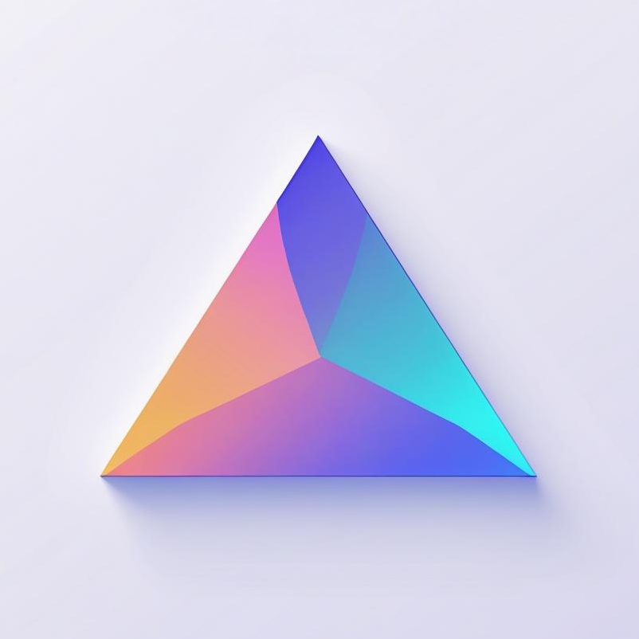

<div align="center">
  

  # Prism

  **A lightning-fast, native text editor for macOS**

  Prism is a modern, lightweight text editor built with Swift and AppKit, designed to fill the Notepad++ gap on macOS. It prioritizes performance, native macOS feel, and simplicity.
</div>

## Status: Phase 1 Complete ✅

Phase 1: Foundation has been successfully implemented with all core features working.

## Features

### Phase 1 (Complete)
- ✅ **Basic Text Editing** - Full-featured text editing with NSTextView
- ✅ **File Operations** - New, Open, Save, Save As with proper dialogs
- ✅ **Menu Bar** - Complete File, Edit, and View menus with keyboard shortcuts
- ✅ **Status Bar** - Shows line count, cursor position (line/column), encoding, language, and line endings
- ✅ **Word Wrap Toggle** - Toggle word wrap on/off (View menu or Cmd+W)
- ✅ **Current Line Highlighting** - Subtle highlight of the current line
- ✅ **Performance Optimizations** - Special handling for large files (>10MB)
- ✅ **Encoding Detection** - Automatic detection of UTF-8, UTF-16, and ASCII
- ✅ **Line Ending Detection** - Detects LF, CRLF, and CR line endings
- ✅ **Language Detection** - Detects programming language from file extension (40+ languages)
- ✅ **Unsaved Changes Warning** - Prompts to save before closing modified documents

### Coming in Phase 2
- 🔄 Syntax highlighting with Tree-sitter
- 🔄 Multiple themes
- 🔄 50+ language support

### Coming in Phase 3
- 📋 Line numbers with gutter
- 🔍 Find & Replace with regex support
- 📑 Multiple tabs
- ⚙️ Preferences window

## Quick Start

### Build and Run

```bash
# Clone the repository
git clone <your-repo-url>
cd prismapp

# Build with Swift Package Manager
swift build

# Run the app
swift run

# Or build a release version
swift build -c release
```

### Create macOS App Bundle

```bash
# Use the build script
./build-app.sh

# Launch the app
open Prism.app
```

For detailed build instructions, see [BUILD.md](BUILD.md).

## Requirements

- macOS 13.0 or later
- Xcode 15.0 or later
- Swift 5.9 or later

## Testing

1. **Basic editing**: Run `swift run` and start typing
2. **File operations**: Test with the provided `test-file.txt`
3. **Large files**: Try opening files >10MB to see performance optimizations
4. **Encoding**: Test with files in different encodings
5. **Menu shortcuts**: Test keyboard shortcuts (⌘N, ⌘O, ⌘S, etc.)

## Project Structure

```
Prism/
├── Sources/Prism/
│   ├── App/
│   │   └── AppDelegate.swift       # App lifecycle and menu setup
│   ├── Core/
│   │   ├── Document/
│   │   │   └── PrismDocument.swift # Document model with file I/O
│   │   └── TextEngine/
│   │       └── PrismTextView.swift # Custom NSTextView
│   └── UI/
│       ├── Windows/
│       │   └── MainWindowController.swift  # Main window and coordination
│       └── Components/
│           └── StatusBar.swift     # Status bar component
├── BUILD.md                        # Detailed build instructions
├── CLAUDE.md                       # AI development guide
└── instructions.md                 # Complete development plan
```

## Performance

Prism is designed for speed:

- **Cold startup**: Target <500ms
- **Memory usage**: <50MB for single file, <150MB for 10 files
- **Large files**: Optimizations kick in at 10MB
- **Smooth scrolling**: 60 FPS even with large files

## Architecture

- **Pattern**: MVC (Model-View-Controller)
- **Language**: Swift 6 with strict concurrency
- **UI Framework**: AppKit (native macOS)
- **Text Engine**: NSTextView with TextKit

See [CLAUDE.md](CLAUDE.md) for detailed architecture documentation.

## License

MIT License - See [LICENSE](LICENSE) for details

## Contributing

Contributions are welcome! Areas for improvement:
- Performance testing with various file sizes
- Bug reports and fixes
- UI/UX improvements
- Documentation

## Roadmap

- **Phase 1** (Complete): Foundation with basic text editing
- **Phase 2** (Next): Syntax highlighting with Tree-sitter
- **Phase 3**: Advanced features (find/replace, line numbers, tabs)
- **Phase 4**: Multi-cursor, plugins, LSP integration
- **v1.0**: Production-ready with comprehensive testing

---

Built with ❤️ for macOS
